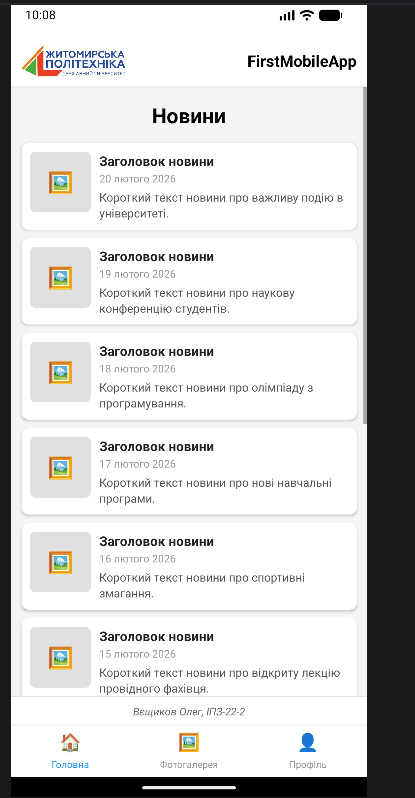
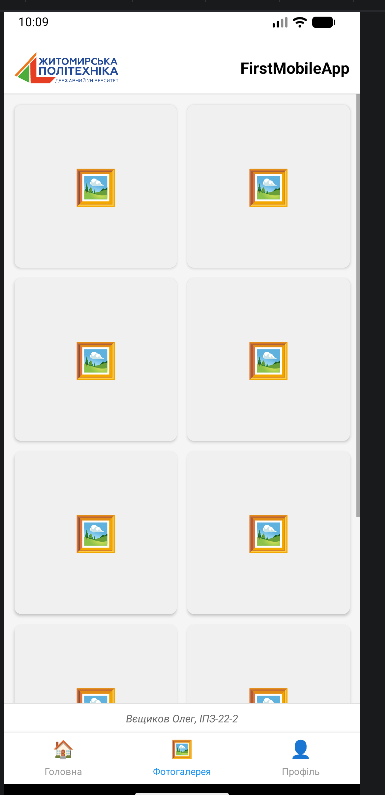
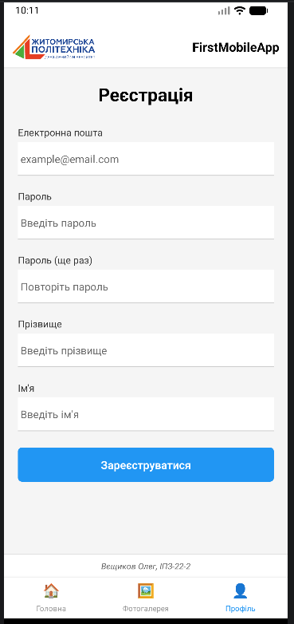

# FirstMobileApp — Лабораторна робота №1

## Опис проєкту

React Native додаток створений з використанням **Expo**, що демонструє основні компоненти та навігацію між екранами. Додаток містить три вкладки:

-  **Головна** — список новин з зображеннями, заголовком, датою та коротким описом
-  **Фотогалерея** — сітка фото у двох колонках
- **Профіль** — форма реєстрації з валідацією полів


## Встановлення та запуск

### Вимоги
- Node.js 18+
- npm або yarn
- Expo Go (мобільний додаток) — для тестування на реальному пристрої

### Кроки встановлення

```bash
# 1. Клонування репозиторію
git https://github.com/VieshchykovOleg/Mobile_lab.git
cd ваш фолдер

# 2. Встановлення залежностей
npm install

# 3. Запуск проєкту
npx expo start
```

## Способи запуску мобільного додатка

### 1. Expo Go (реальний пристрій)

### 2. Android Emulator (AVD)

### 3. Expo Snack (онлайн)


## Скріншоти екранів

### Головна сторінка


### Фотогалерея


### Профіль



## Автор

Вєщиков Олег, ІПЗ-22-2
