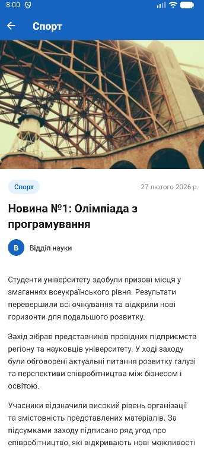

# Lab2App — Лабораторна робота №2

## Тема
Побудова вкладеної навігації та оптимізація відображення великих списків у React Native із використанням компонентів FlatList та SectionList.

## Реалізований функціонал

### Навігація
- **Drawer Navigator** — бокове меню з кастомним компонентом (аватар, ПІБ, група, пункти меню)
- **Stack Navigator** (вкладений у Drawer) — навігація між екраном новин та екраном деталей
- Передача параметрів між екранами (`route.params`)
- Динамічний заголовок екрану деталей (`useLayoutEffect`)
- Усунено подвійний header (`headerShown: false` на Stack у Drawer)

### FlatList (екран Новини)
- **Pull-to-Refresh** — оновлення списку свайпом вниз з імітацією запиту (`setTimeout` 1.5с)
- **Infinite Scroll** — автоматичне підвантаження 10 новин при досягненні кінця списку
- `ListHeaderComponent` — заголовок списку з назвою розділу
- `ListFooterComponent` — індикатор завантаження або лічильник новин
- `ItemSeparatorComponent` — відступ між елементами
- Параметри оптимізації: `initialNumToRender=10`, `maxToRenderPerBatch=5`, `windowSize=10`

### SectionList (екран Контакти)
- Секції: Ректорат, ФІТ, Студентська рада, Бібліотека
- `renderSectionHeader` — кастомні заголовки секцій
- `stickySectionHeadersEnabled` — заголовки "прилипають" при прокрутці
- Клікабельні телефони та email (через `Linking`)

### Кастомний Drawer
- Аватар з ініціалами
- ПІБ студента та група
- Пункти меню: Новини, Контакти
- Підсвічування активного пункту


## Встановлення та запуск

```bash
# 1. Клонувати репозиторій
git clone https://github.com/VieshchykovOleg/MobileLabsRN2026
cd MobileLabsRN2026/lab2

# 2. Встановити залежності
npm install

# 3. Запустити
npx expo start
```
## Скріншоти роботи
### 1. Головна сторінка


### 2. Користувацьке меню


### 3. Контакти університету


### 4. Деталі посту


## Висновки (відповіді на контрольні запитання)

**1. Чим відрізняється FlatList від ScrollView?**
ScrollView рендерить усі елементи одразу, що при великих списках призводить до значного споживання пам'яті. FlatList використовує віртуалізацію — рендерить лише видимі елементи, невидимі вивантажуються з пам'яті.

**2. Що таке віртуалізація списків?**
Механізм, за якого в DOM-подібному дереві присутні лише елементи, які зараз видимі на екрані. При прокрутці елементи, що виходять за межі екрану, видаляються, а нові — додаються. Це дозволяє відображати тисячі елементів без просідання продуктивності.

**3. Як здійснюється передача параметрів між екранами?**
Через другий аргумент функції `navigate`: `navigation.navigate('Details', { newsItem: item })`. На цільовому екрані параметри доступні через `route.params`.

**4. Що таке вкладена навігація?**
Архітектура, коли один навігатор містить інший. Наприклад: Drawer Navigator містить Stack Navigator, який у свою чергу керує екранами Main та Details. Це дозволяє будувати складні ієрархії навігації.

**5. У яких випадках застосовується SectionList?**
Коли потрібно відобразити дані, згруповані за категоріями (розділами). Наприклад: контакти по відділах, товари по категоріях, повідомлення по датах. На відміну від FlatList, SectionList підтримує заголовки секцій та їх "прилипання" при прокрутці.

## Автор

Вєщиков Олег Миколайович, група ІПЗ-22-2
