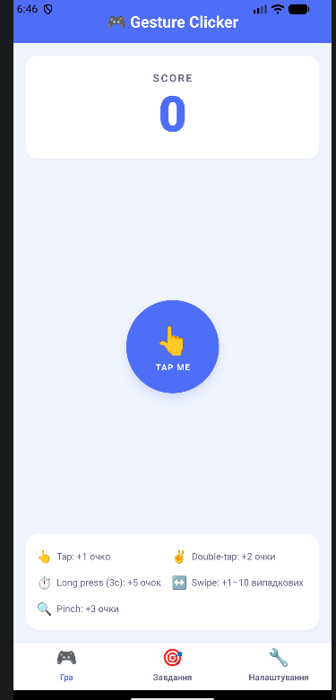

# GestureClicker — Лабораторна робота №3

## Тема
Використання кастомних жестів у React Native та стилізація інтерфейсу мобільного застосунку.

## Встановлення та запуск

```bash
git clone https://github.com/VieshchykovOleg/MobileLabsRN2026
cd MobileLabsRN2026/lab3
npm install
npx expo start
```
## Скріншоти роботи



## Реалізований функціонал


### Екран "Завдання"
9 завдань з прогрес-баром та статусом виконання:
- Зробити 10 кліків
- Подвійний клік 5 разів
- Утримати 3 секунди
- Перетягнути об'єкт
- Свайп вправо / вліво
- Змінити розмір (pinch)
- Набрати 100 / 500 очок (власне завдання)

### Екран "Налаштування"
- Перемикач світлої/темної теми
- Статистика (рахунок, виконані завдання)
- Довідка по жестах
- Кнопка скидання прогресу з підтвердженням

### Стилізація
- Динамічна тема через React Context (`ThemeProvider`)
- Підтримка світлої та темної теми
- Стилі через `StyleSheet.create` з об'єктом теми

## Висновки

Під час виконання лабораторної роботи було вивчено роботу з жестовими обробниками бібліотеки `react-native-gesture-handler`. 

## Автор
Вєщиков Олег, група ІПЗ-22-2
