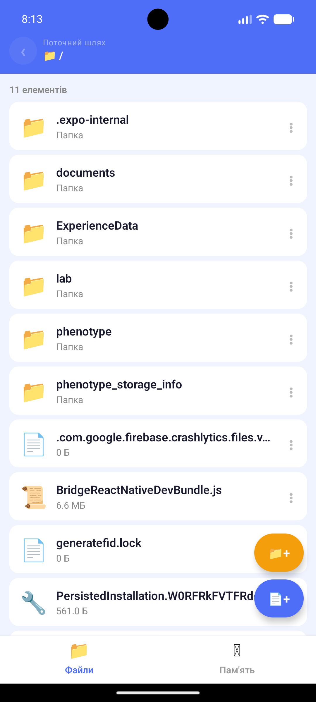
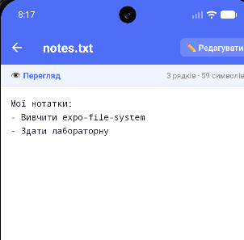
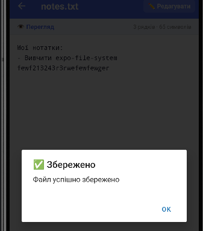
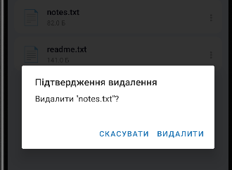
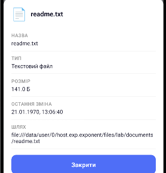

# FileManager — Лабораторна робота №4

## Тема
Робота з файловою системою в React Native з використанням бібліотеки `expo-file-system`.

## Встановлення та запуск

```bash
cd lab4
npm install
npx expo start
```

## Реалізований функціонал

### 1. Навігація по файловій системі
- Відображення поточного шляху у заголовку (breadcrumb)
- FlatList зі списком файлів і папок (папки першими)
- Перехід у підпапку натисканням
- Кнопка «назад» для повернення до попередньої директорії

### 2. Створення
- FAB-кнопки для створення папки та файлу
- Модальне вікно з введенням назви та початкового вмісту
- Автоматичне додавання `.txt` якщо розширення не вказано

### 3. Зчитування
- Відкриття `.txt` файлів у режимі перегляду
- Відображення кількості рядків та символів
- Моноширний шрифт для зручного читання

### 4. Редагування
- Перемикання між режимом перегляду та редагування
- Попередження про незбережені зміни при виході
- Збереження через `FileSystem.writeAsStringAsync`

### 5. Видалення
- Кнопка видалення через ActionSheet (довге натискання або кнопка ⋮)
- Підтвердження перед видаленням через `Alert`

### 6. Детальна інформація
- Назва файлу
- Тип (визначається за розширенням)
- Розмір (форматований: Б / КБ / МБ)
- Дата останньої модифікації

### 7. Статистика пам'яті (окрема вкладка)
- Загальний обсяг сховища
- Вільний простір
- Зайнятий простір
- Прогрес-бар з кольоровим індикатором (зелений / жовтий / червоний)
- Розмір папки документів додатку

### 8. Скріншоти додатку
## 1. Навігація по локальній файловій системі додатку

## 2. Створення


## 3. Зчитування

## 4. Редагування


## 5. Видалення

## 6. Перегляд детальної інформації про файл

## 7. Статистика використання памʼяті пристрою

## Автор
Вєщиков Олег, група ІПЗ-22-2
