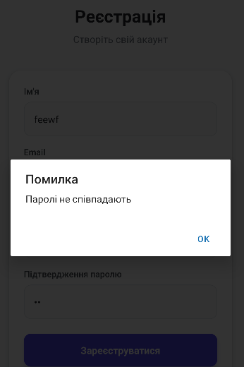
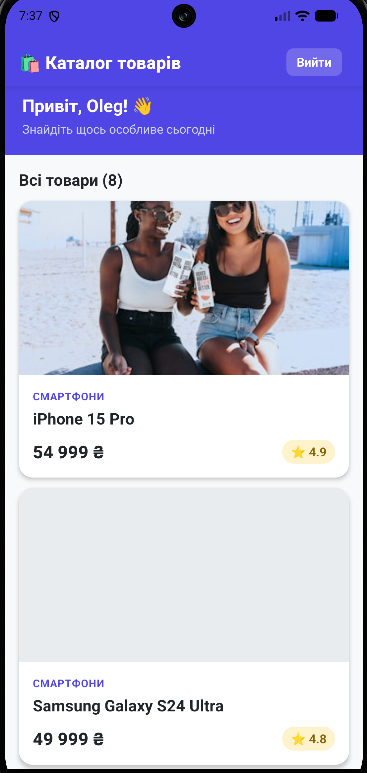

# Лабораторна робота №5 — Навігація у React Native із Expo Router

## Опис проєкту

Мобільний застосунок-каталог товарів, побудований з використанням **React Native** та **Expo Router** (file-based маршрутизація). Реалізовано повний цикл автентифікації, захищені маршрути та динамічну навігацію.

---

## Інструкція запуску

### Кроки

```bash
cd lab5
npm install
npm start
```

Після запуску відскануйте QR-код у застосунку **Expo Go** на телефоні.

---
### Авторизація
- Глобальний `AuthContext` зберігає стан `isAuthenticated`, `user`
- Функції: `login(email, password)`, `register(email, password, name)`, `logout()`
- Захист маршрутів: `<Redirect href="/login" />` у `(app)/_layout.jsx`

### Публічні екрани
- **Екран входу** (`/login`): поля Email, Пароль; посилання на реєстрацію
- **Екран реєстрації** (`/register`): поля Ім'я, Email, Пароль, Підтвердження паролю; посилання на вхід
- Валідація форм з відповідними повідомленнями про помилки

### Захищені екрани (каталог)
- **Головний екран** (`/`): `FlatList` з 8 товарами, кнопка "Вийти"
- **Деталі товару** (`/details/[id]`): повна інформація, параметр `id` через `useLocalSearchParams`
- **404 екран**: повідомлення про помилку + кнопка повернення

### Модель даних
8 товарів у категоріях: Смартфони, Ноутбуки, Аудіо, Планшети, Смарт-годинники, Телевізори.

---

## Скріншоти




