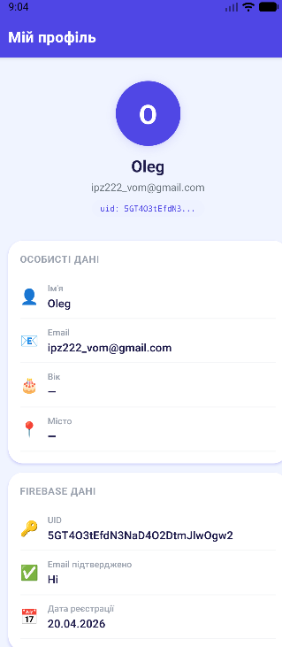
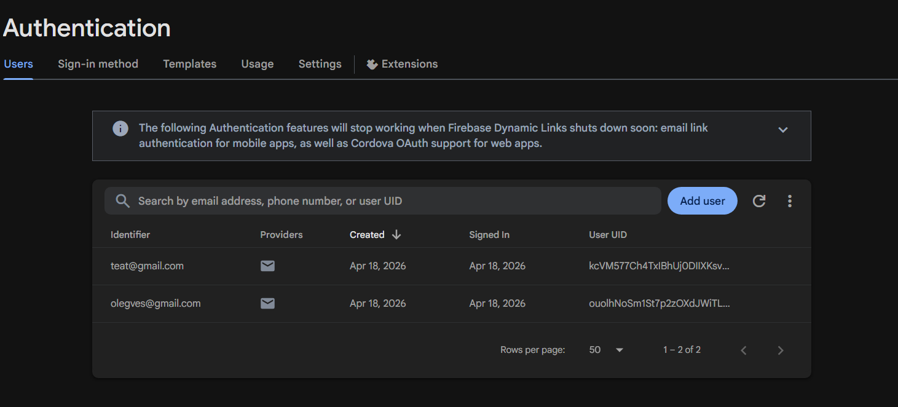
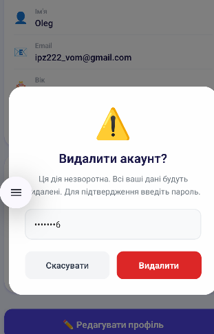
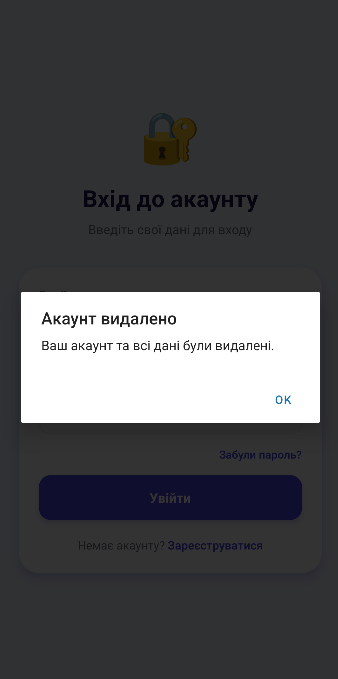
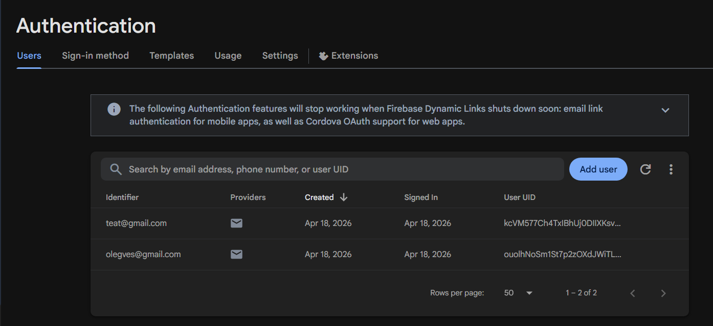
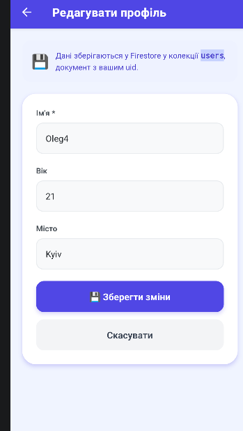
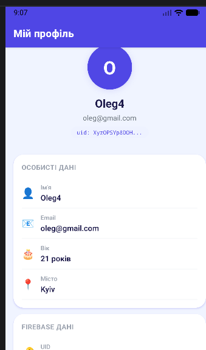

# Лабораторна робота №6 — Firebase Auth та Firestore у React Native

## Опис проєкту

Мобільний застосунок із повним циклом авторизації через **Firebase Authentication** та збереженням персональних даних у **Firebase Firestore**. Побудовано на **Expo Router** із захищеними маршрутами.

---

##  Інструкція запуску

### 1. Створити Firebase проєкт

1. Перейдіть на [firebase.google.com](https://firebase.google.com) → **Console**
2. Натисніть **Add project** → дайте назву → **Create project**
3. Підключіть **Authentication**: Build → Authentication → Get started → Email/Password → Enable
4. Підключіть **Firestore**: Build → Firestore Database → Create database → Start in test mode

### 2. Отримати конфігурацію

У Firebase Console: **Project Settings** → **Your apps** → **Add app** → Web (`</>`)  
Скопіюйте об'єкт `firebaseConfig`.

### 3. Додати конфігурацію у проєкт
### 4. Налаштувати Firestore Security Rules
### 5. Встановити залежності та запустити

```bash
npm install
npm start
```

Відскануйте QR у застосунку **Expo Go**.

---

## Реалізований функціонал

### Авторизація (Firebase Authentication)
| Функція | Опис |
|---|---|
| Реєстрація | `createUserWithEmailAndPassword` + запис у Firestore |
| Вхід | `signInWithEmailAndPassword` |
| Вихід | `signOut` |
| Відновлення паролю | `sendPasswordResetEmail` → лист на пошту |
| Відстеження стану | `onAuthStateChanged` у `AuthContext` |

### Firestore
| Дія | Деталі |
|---|---|
| Запис профілю | `setDoc(doc(db, 'users', uid), data)` при реєстрації |
| Читання профілю | `getDoc(doc(db, 'users', uid))` після входу |
| Оновлення профілю | `updateDoc(doc(db, 'users', uid), data)` |
| Видалення профілю | `deleteDoc(doc(db, 'users', uid))` перед видаленням акаунта |


###  Видалення акаунта
Перед видаленням виконується **повторна автентифікація** (`reauthenticateWithCredential`) — вимога Firebase для чутливих операцій.

---

## Скріншоти











## Висновки

У ході виконання лабораторної роботи набуто практичних навичок:

1. **Інтеграція Firebase Auth** у React Native: реєстрація, вхід, вихід, скидання паролю та видалення акаунта з повторною автентифікацією.

2. **Робота з Firestore**: збереження та оновлення даних у документах колекції `users`, де id документа дорівнює `uid` користувача.

3. **Firestore Security Rules**: реалізація серверних правил безпеки, що гарантують доступ лише до власних даних незалежно від клієнтського коду.

4. **AuthContext**: централізоване управління станом авторизації через React Context з підпискою на `onAuthStateChanged`.

5. **Захищені маршрути**: використання `<Redirect>` у `(app)/_layout.jsx` для автоматичного перенаправлення неавторизованих користувачів.
